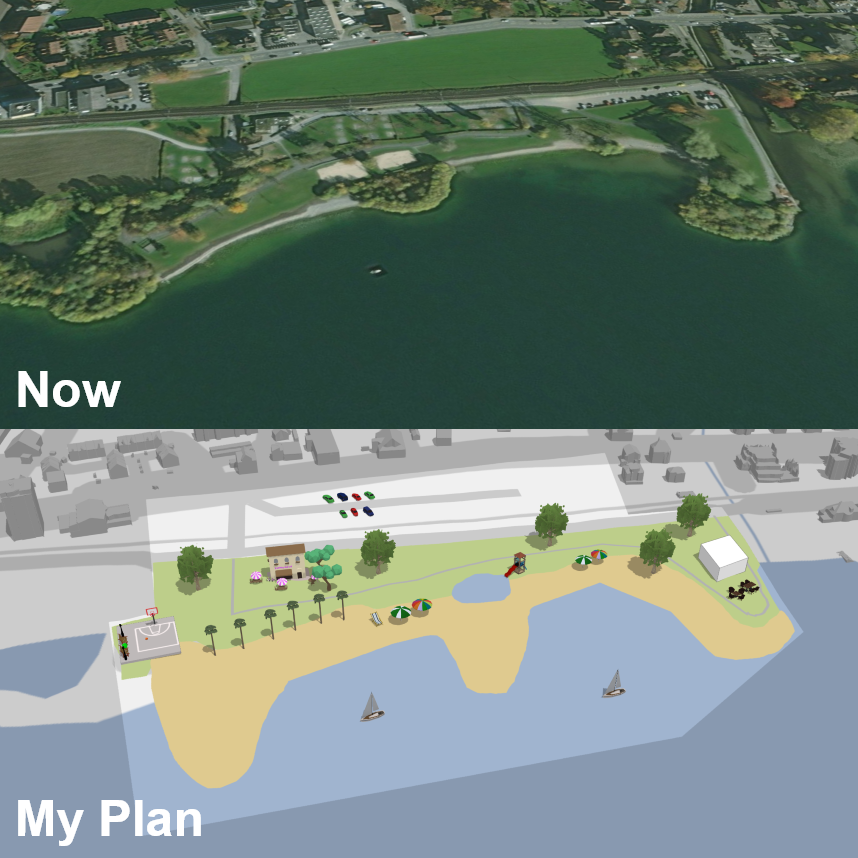

# Adopted "Participatory Planning" repository

This repository is a fork from [participatory-planning on esri](https://github.com/Esri/participatory-planning). This awesome app is created by Developer Evangelist Arno Fiva at Esri R&D Center Zurich.
He explains all details in this [blog](https://www.esri.com/arcgis-blog/products/js-api-arcgis/3d-gis/create-your-next-neighborhood-in-3d/).

A live version is available [here](https://saschabrunnerch.github.io/participatory-planning/).


## Participatory Planning in a real scenario in the town Zug, Switzerland

I adopted this application for a real "Participatory Planning" discussion in my homwtown Zug in Switzerland. By the year 2022 the area "Brüggli" near to the lake should be redeveloped. The camping place should be removed and there should be more space for sportsperson, bather and 
recreation seekers. Details can be found on the [goverment page about the "Richtplanung"](https://www.zg.ch/behoerden/baudirektion/arv/richtplanung)
Text in german: <br>"Die Stadt Zug wertet mit dem Kanton und der Korporation Zug das Gebiet Brüggli für die Erholung auf. Der Campingplatz in seiner heutigen Form (fixe Stellplätze) ist bis spätestens 2022 aufzuheben. Der freiwerdende Platz ist für Sportlerinnen und Sportler, Badende und Erholungsuchende aufzuwerten. Die fixe Parkierung südlich der SBB Geleise ist aufzuheben. Mittels
gezielter Aufschüttungen im Zugersee ist die Flachwasserzone ökologisch aufzuwerten und für
die Erholung suchenden erlebbar zu machen. Im Gebiet östlich der Mündung der alten Lorze in
den Zugersee hat der Naturschutz Priorität."<br>
This application allows the citizen to participate and show there solution for this area.

## 5 steps to adopt the application to another planning area in another town

This application is adoptable in the simple following steps and can be used for every "Participatory Planning" in any town.

1.  Create a new [Webscene](https://doc.arcgis.com/en/arcgis-online/reference/what-is-web-scene.htm) with data matching the area
    1.  Create a [Webscene in ArcGIS Online](https://doc.arcgis.com/en/arcgis-online/get-started/get-started-with-scenes.htm)
    2.  Add some 3D-Data (buildings, trees, ...) for the area 
    2.  Capture slides with speaking names (they show up on top of the application)   
2.  Add the id of the new Webscene to the attribute `webSceneId` in the file `src/index.ts`
3.  Change the coordinates for the planning area in the attribute `planningArea` in the file `src/index.ts`
4.  Create a new thumbnail and change text and link to the thumbnail in the file `src/ts/App.tsx`
5.  Create a new build and deploy to the webserver with `npm run buid`

[](https://saschabrunnerch.github.io/participatory-planning)

<br><br><br><br><br>


# Participatory Planning

An interactive 3D web application enabling citizens to engage in urban planning, using the [ArcGIS API for JavaScript](https://developers.arcgis.com/javascript/). This is a non-commercial demo application made by the Esri R&D Center Zurich. It is intended for presentations or as a starting point for new projects.

[](https://esri.github.io/participatory-planning)

The app uses various API features such as [3D drawing](https://developers.arcgis.com/javascript/latest/api-reference/esri-widgets-Sketch.html), [glTF import](https://developers.arcgis.com/javascript/latest/sample-code/import-gltf/index.html) and [client-side filtering](https://developers.arcgis.com/javascript/latest/api-reference/esri-views-layers-support-FeatureFilter.html). The example scene used in the app is located in Dumbo, Brooklyn NY.

On the technical side the app is built using [TypeScript](https://www.typescriptlang.org/), [npm](https://www.npmjs.com/) and [webpack](https://webpack.js.org/).

## Instructions

A live version is available [here](https://esri.github.io/participatory-planning).

To run the source code locally, follow these steps:

```
git clone https://github.com/Esri/participatory-planning.git
cd participatory-planning/
npm install
npm run start # serves application at http://localhost:8080
```

## Configuration

If you would like to use the app for a different area or city, see the file [index.ts](./src/index.ts) for available options.

## Resources
The following external libraries, APIs, open datasets and specifications were used to make this application:
* [ArcGIS API for JavaScript](https://developers.arcgis.com/javascript/)
* Icons from [Font Awesome](https://fontawesome.com/)
* [Anime.js](https://animejs.com) for animations
* [zip.js](https://gildas-lormeau.github.io/zip.js/) for extracting glTF models
* [Calcite Web](http://esri.github.io/calcite-web/)
* [Sketchfab widget](https://sketchfab.com/developers/download-api/downloading-models/javascript) for downloading glTF models
* [3D building model](http://www1.nyc.gov/site/doitt/initiatives/3d-building.page) published on the Open Data portal of [DoITT](http://www1.nyc.gov/site/doitt/index.page) under these [Terms of use](http://www1.nyc.gov/home/terms-of-use.page)
* [Manhattan neighborhoods](http://catalog.opendata.city/dataset/pediacities-nyc-neighborhoods/resource/91778048-3c58-449c-a3f9-365ed203e914) provided by [Catalog Opendata City](http://catalog.opendata.city/) under a [Open Data Commons Attribution License](http://opendefinition.org/licenses/odc-by/)

## Disclaimer

This demo application is for illustrative purposes only and it is not maintained. The area in Dumbo, Brooklyn NY used in the application is a fictional redevelopment area. There is no support available for deployment or development of the application.

## Contributing

Esri welcomes contributions from anyone and everyone. Please see our [guidelines for contributing](https://github.com/esri/contributing).

## Licensing
Copyright 2019 Esri

Licensed under the Apache License, Version 2.0 (the "License");
you may not use this file except in compliance with the License.
You may obtain a copy of the License at

   http://www.apache.org/licenses/LICENSE-2.0

Unless required by applicable law or agreed to in writing, software
distributed under the License is distributed on an "AS IS" BASIS,
WITHOUT WARRANTIES OR CONDITIONS OF ANY KIND, either express or implied.
See the License for the specific language governing permissions and
limitations under the License.

A copy of the license is available in the repository's [license.txt](./license.txt) file.
